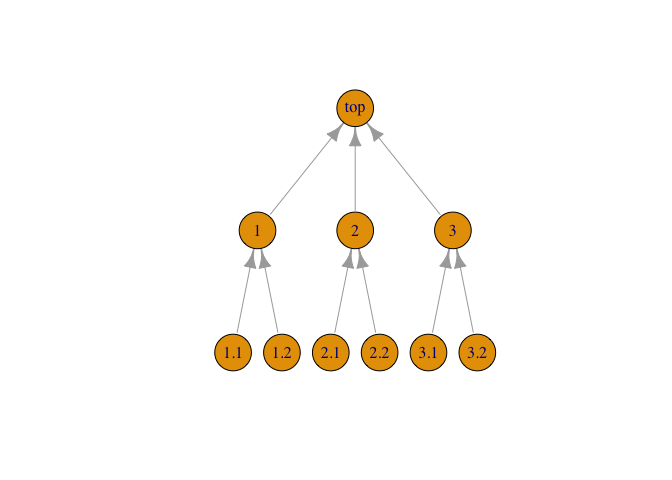

<!-- README.md is generated from README.Rmd. Please edit that file -->

# rollup

<!-- badges: start -->
<!-- badges: end -->

Rollup is a general framework for solving problems in which some
property a parent element is some combination of corresponding
properties of its child elements. The mass of an assembly, for example,
can be construed as the sum of the masses of its subassemblies, and the
mass of each subassembly is the sum of masses of its parts.

Rollup can solve problems specified by arbitrarily-shaped (but
well-formed) trees, arbitrarily-defined properties and
property-combining operations. Defaults are provided to simplify common
cases (atomic numerical properties combined by summing), but functional
programming techniques allow the caller to pass arbitrary *get*, *set*,
and *combine* methods at runtime.

## Installation

You can install the development version of rollup from
[GitHub](https://github.com/) with:

``` r
# install.packages("pak")
pak::pak("jsjuni/rollup")
```

## Example

Consider this example Work Breakdown Structure from
[WorkBreakdownStructure.com](https://www.workbreakdownstructure.com):

[](https://www.workbreakdownstructure.com)

The computations in the example are worked out already; we show here how
to reproduce them.

A Work Breakdown Structure is a tree, that is, a graph that is connected
and acyclic. It is, in addition, directed, that is, the edges have
direction. We arbitrarily chose the edge direction to go from child to
parent. Finally, it is single-rooted: every vertex but one has a single
parent vertex; the root vertex has no parent.

The leaf elements (vertices) of the tree require asserted values for the
properties (work, budget) of interest. Property values for non-leaf
elements are computed by the rollup operation.

We begin by capturing the structure of the tree and asserted values in a
data frame we call `wbs_table`. Values to be computed are initially
unknown. Each element is uniquely identified by an `id` column[^1]. We
also indicate parent id in the `pid` column but this information is not
used directly by `rollup()`.

``` r
library(rollup)
knitr::kable(wbs_table)
```

| id  | pid | name                    | work | budget |
|:----|:----|:------------------------|-----:|-------:|
| top | NA  | Construction of a House |   NA |     NA |
| 1   | top | Internal                |   NA |     NA |
| 2   | top | Foundation              |   NA |     NA |
| 3   | top | External                |   NA |     NA |
| 1.1 | 1   | Electrical              | 11.8 |  25000 |
| 1.2 | 1   | Plumbing                | 33.8 |  61000 |
| 2.1 | 2   | Excavate                | 18.2 |  37000 |
| 2.2 | 2   | Steel Erection          |  5.8 |   9000 |
| 3.1 | 3   | Masonry Work            | 16.2 |  62000 |
| 3.2 | 3   | Building Finishes       | 14.2 |  21500 |

A key feature of recursively-defined problems like this is that the
computations must be ordered in such a way that the computations for a
given element must occur after properties for it children are known
(either asserted or computed). Traversing a tree in this manner is a
well-known algorithm in graph theory known as *depth-first (postorder)
search*. For that reason, we construct a graph object in R, from which
we can conveniently (1) check that the graph is in fact a well-formed
tree, and (2) efficiently execute a depth-first search to order the
computations. (Note that, although the problems solved by rollup are
*defined* recursively, the implementation in software is not recursive.)

It is a simple matter to construct a graph from the information in our
data frame:

``` r
library(igraph)
#> 
#> Attaching package: 'igraph'
#> The following objects are masked from 'package:stats':
#> 
#>     decompose, spectrum
#> The following object is masked from 'package:base':
#> 
#>     union
wbs_tree <- igraph::graph_from_edgelist(
  as.matrix(wbs_table[which(!is.na(wbs_table$pid)), c("id", "pid")]),
  directed = TRUE
)
coords <- layout_(wbs_tree, as_tree(mode="in"))
plot(wbs_tree, layout=coords, vertex.size=30)
```



Although our data in this first example is a data frame, `rollup()` can
operate on an arbitrary R object if provided with update and validate
methods for that object. For the common case in which the parameter of
interest is a numeric column in a data frame, the combine operation is
addition, and the key column is named “id”, the package provides
`update_df_prop_by_id()` and `validate_df_by_id()` helper methods that
can be invoked as boilerplate. To roll up the `work` property, for
example, we simply invoke:

``` r
result1 <- rollup(
  tree=wbs_tree,
  ds=wbs_table,
  update=function(d, t, s) update_df_prop_by_id(df=d, target=t, sources=s, prop="work"),
  validate_ds=function(t, d) validate_df_by_id(tree=t, df=d, prop="work")
)
knitr::kable(result1)
```

| id  | pid | name                    |  work | budget |
|:----|:----|:------------------------|------:|-------:|
| top | NA  | Construction of a House | 100.0 |     NA |
| 1   | top | Internal                |  45.6 |     NA |
| 2   | top | Foundation              |  24.0 |     NA |
| 3   | top | External                |  30.4 |     NA |
| 1.1 | 1   | Electrical              |  11.8 |  25000 |
| 1.2 | 1   | Plumbing                |  33.8 |  61000 |
| 2.1 | 2   | Excavate                |  18.2 |  37000 |
| 2.2 | 2   | Steel Erection          |   5.8 |   9000 |
| 3.1 | 3   | Masonry Work            |  16.2 |  62000 |
| 3.2 | 3   | Building Finishes       |  14.2 |  21500 |

`update_df_prop_by_id()` (like every well-behaved update method)
modifies only the specified column and leaves the rest of the data frame
unchanged. If we want to roll up the `budget` column as well, we can
simply chain two `rollup()` together. In this example we use R’s pipe
operator:

``` r
result2 <- rollup(
  tree=wbs_tree,
  ds=wbs_table,
  update=function(d, t, s) update_df_prop_by_id(df=d, target=t, sources=s, prop="work"),
  validate_ds=function(t, d) validate_df_by_id(tree=t, df=d, prop="work")
) |> rollup(
  tree=wbs_tree,
  ds=_,
  update=function(d, t, s) update_df_prop_by_id(df=d, target=t, sources=s, prop="budget"),
  validate_ds=function(t, d) validate_df_by_id(tree=t, df=d, prop="budget")
)
knitr::kable(result2)
```

| id  | pid | name                    |  work | budget |
|:----|:----|:------------------------|------:|-------:|
| top | NA  | Construction of a House | 100.0 | 215500 |
| 1   | top | Internal                |  45.6 |  86000 |
| 2   | top | Foundation              |  24.0 |  46000 |
| 3   | top | External                |  30.4 |  83500 |
| 1.1 | 1   | Electrical              |  11.8 |  25000 |
| 1.2 | 1   | Plumbing                |  33.8 |  61000 |
| 2.1 | 2   | Excavate                |  18.2 |  37000 |
| 2.2 | 2   | Steel Erection          |   5.8 |   9000 |
| 3.1 | 3   | Masonry Work            |  16.2 |  62000 |
| 3.2 | 3   | Building Finishes       |  14.2 |  21500 |

In most cases, this approach suffices. The code is simple and clear, and
performance is not typically an issue. (In other testing `rollup()`
performs tens of thousands of non-trivial property updates per second.)
We show here some alternate approaches, mainly to illustrate
architectural features of the approach that may be useful for more
esoteric applications.

A valid update method returns the updated data set, so we can chain two
updates within a single `rollup()` instead of chaining two `rollup()`s.
Similarly, a data set validator returns a logical value, so we can make
the conjunction of two validators:

``` r
result3 <- rollup(
  tree = wbs_tree,
  ds = wbs_table,
  update = function(d, t, s) {
    update_df_prop_by_id(
      df = d,
      target = t,
      sources = s,
      prop = "work"
    ) |>
      update_df_prop_by_id(target = t,
                           sources = s,
                           prop = "budget")
  },
  validate_ds = function(t, d) {
    validate_df_by_id(tree = t, df = d, prop = "work") &&
      validate_df_by_id(tree = t, df = d, prop = "budget")
  }
)
knitr::kable(result3)
```

| id  | pid | name                    |  work | budget |
|:----|:----|:------------------------|------:|-------:|
| top | NA  | Construction of a House | 100.0 | 215500 |
| 1   | top | Internal                |  45.6 |  86000 |
| 2   | top | Foundation              |  24.0 |  46000 |
| 3   | top | External                |  30.4 |  83500 |
| 1.1 | 1   | Electrical              |  11.8 |  25000 |
| 1.2 | 1   | Plumbing                |  33.8 |  61000 |
| 2.1 | 2   | Excavate                |  18.2 |  37000 |
| 2.2 | 2   | Steel Erection          |   5.8 |   9000 |
| 3.1 | 3   | Masonry Work            |  16.2 |  62000 |
| 3.2 | 3   | Building Finishes       |  14.2 |  21500 |

In this example we create a custom *get* method that builds a named
vector from the specified properties (using lower-level helper method
`df_get_by_id()`) and a corresponding *set* method (using
`df_set_by_id()`). We then create a custom *update* method using these
methods. (The default *combine* method still works because R knows how
to add vectors.) Finally, we create a custom data set validator and
invoke `rollup()` with our custom methods.

``` r
my_get <- function(d, i) c(
  w=df_get_by_id(df=d, id=i, prop="work"),
  b=df_get_by_id(df=d, id=i, prop="budget")
)
my_set <- function(d, i, v) {
  df_set_by_id(df=d, id=i, prop="work", val=v["w"]) |>
    df_set_by_id(id=i, prop="budget", val=v["b"])
}
my_update <- function(d, t, s) {
    update_prop(ds=d, target=t, sources=s, set=my_set, get=my_get)
}
my_validate <- function(t, d) {
  validate_ds(tree=t, ds=d,
               get_keys=function(d) df_get_ids(df=d),
               get_prop=my_get,
               op=function(v) my_check(v["w"]) && my_check(v["b"])
  )
}
my_check <- function(v)
  is.numeric(v) && !is.na(v) && (v > 0.0)

result4 <- rollup(
  tree = wbs_tree,
  ds = wbs_table,
  update = my_update,
  validate_ds = my_validate
)
knitr::kable(result4)
```

| id  | pid | name                    |  work | budget |
|:----|:----|:------------------------|------:|-------:|
| top | NA  | Construction of a House | 100.0 | 215500 |
| 1   | top | Internal                |  45.6 |  86000 |
| 2   | top | Foundation              |  24.0 |  46000 |
| 3   | top | External                |  30.4 |  83500 |
| 1.1 | 1   | Electrical              |  11.8 |  25000 |
| 1.2 | 1   | Plumbing                |  33.8 |  61000 |
| 2.1 | 2   | Excavate                |  18.2 |  37000 |
| 2.2 | 2   | Steel Erection          |   5.8 |   9000 |
| 3.1 | 3   | Masonry Work            |  16.2 |  62000 |
| 3.2 | 3   | Building Finishes       |  14.2 |  21500 |

Finally, we illustrate the use of a custom combiner. Suppose we have 5%
uncertainty in our leaf cost numbers. Add those uncertainty numbers to
our data frame:

``` r
new_wbs_table <- result2
new_wbs_table$budget_unc <- ifelse(is.na(wbs_table$budget), NA, wbs_table$budget * 0.05)
knitr::kable(new_wbs_table)
```

| id  | pid | name                    |  work | budget | budget_unc |
|:----|:----|:------------------------|------:|-------:|-----------:|
| top | NA  | Construction of a House | 100.0 | 215500 |         NA |
| 1   | top | Internal                |  45.6 |  86000 |         NA |
| 2   | top | Foundation              |  24.0 |  46000 |         NA |
| 3   | top | External                |  30.4 |  83500 |         NA |
| 1.1 | 1   | Electrical              |  11.8 |  25000 |       1250 |
| 1.2 | 1   | Plumbing                |  33.8 |  61000 |       3050 |
| 2.1 | 2   | Excavate                |  18.2 |  37000 |       1850 |
| 2.2 | 2   | Steel Erection          |   5.8 |   9000 |        450 |
| 3.1 | 3   | Masonry Work            |  16.2 |  62000 |       3100 |
| 3.2 | 3   | Building Finishes       |  14.2 |  21500 |       1075 |

The standard technique for accumulating uncertainties is to combine
using root-sum-square (RSS).

``` r
combine_rss <- function(vl) {
  sqrt(Reduce(f = `+`, x = Map(
    f = function(v)
      v * v,
    vl
  )))
}
result5 <- rollup(
  tree = wbs_tree,
  ds = new_wbs_table,
  update = function(d, t, s)
    update_df_prop_by_id(
      df = d,
      target = t,
      sources = s,
      prop = "budget_unc",
      combine = combine_rss
    ),
  validate_ds = function(t, d)
    validate_df_by_id(tree = t, df = d, prop = "budget_unc"),
)
result5$budget_unc_pct <- result5$budget_unc / result5$budget * 100.
knitr::kable(result5, digits = 1)
```

| id  | pid | name                    |  work | budget | budget_unc | budget_unc_pct |
|:----|:----|:------------------------|------:|-------:|-----------:|---------------:|
| top | NA  | Construction of a House | 100.0 | 215500 |     5025.5 |            2.3 |
| 1   | top | Internal                |  45.6 |  86000 |     3296.2 |            3.8 |
| 2   | top | Foundation              |  24.0 |  46000 |     1903.9 |            4.1 |
| 3   | top | External                |  30.4 |  83500 |     3281.1 |            3.9 |
| 1.1 | 1   | Electrical              |  11.8 |  25000 |     1250.0 |            5.0 |
| 1.2 | 1   | Plumbing                |  33.8 |  61000 |     3050.0 |            5.0 |
| 2.1 | 2   | Excavate                |  18.2 |  37000 |     1850.0 |            5.0 |
| 2.2 | 2   | Steel Erection          |   5.8 |   9000 |      450.0 |            5.0 |
| 3.1 | 3   | Masonry Work            |  16.2 |  62000 |     3100.0 |            5.0 |
| 3.2 | 3   | Building Finishes       |  14.2 |  21500 |     1075.0 |            5.0 |

[^1]: `id` is the default but any valid column name can be used. Values
    should be character data.
